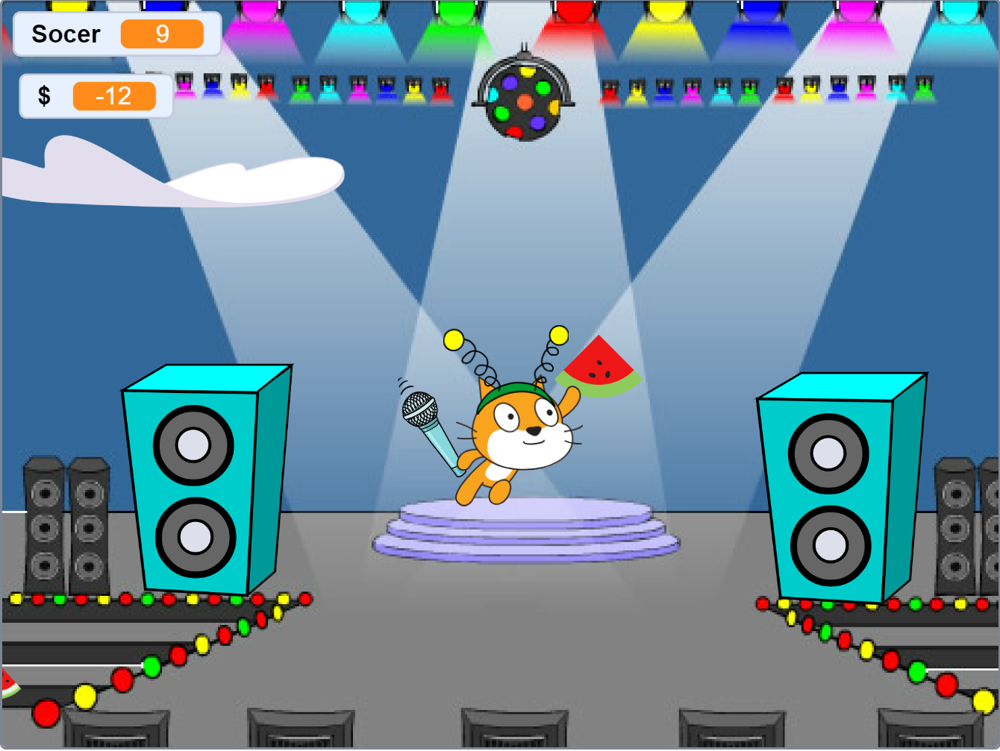

# Meo Scratch 
*Just for fun my undone scratch project* 

## About 
Created on: 19 ‎March ‎2020

This is my game project when I was a kid. There are many logic errors and many flaws but I leave it there to review my old self :]

## How to play:
- Click the green flag to start.
- Use the 4 arrow keys to move.
- Touch a Watermelon to gain +1 Score.
- You start with $100.  
- Touch a Star to regenerate money.  
- Hitting a Hippo makes you lose money.  
- If your money drops to 0 or below, the game is over and Meo (the cat) will tell you your final Score.
  

